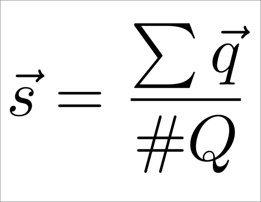
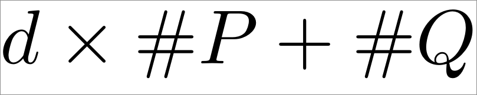
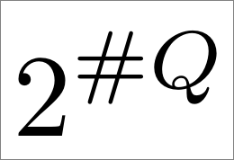
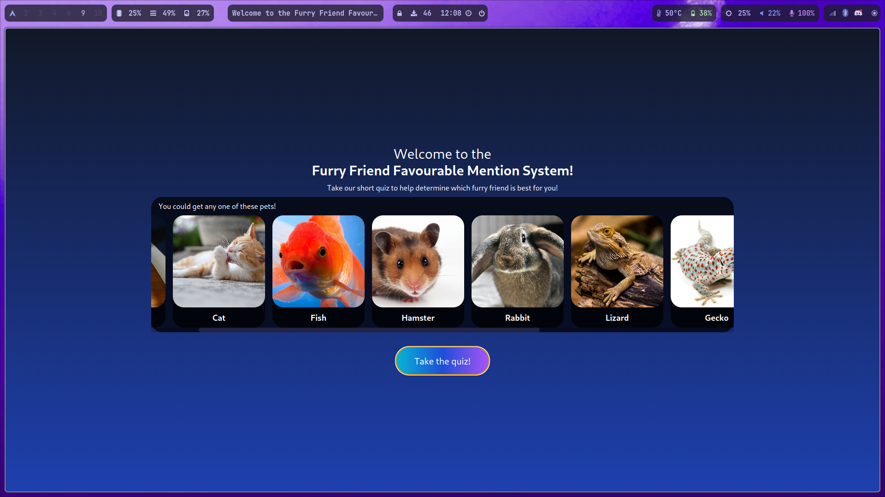
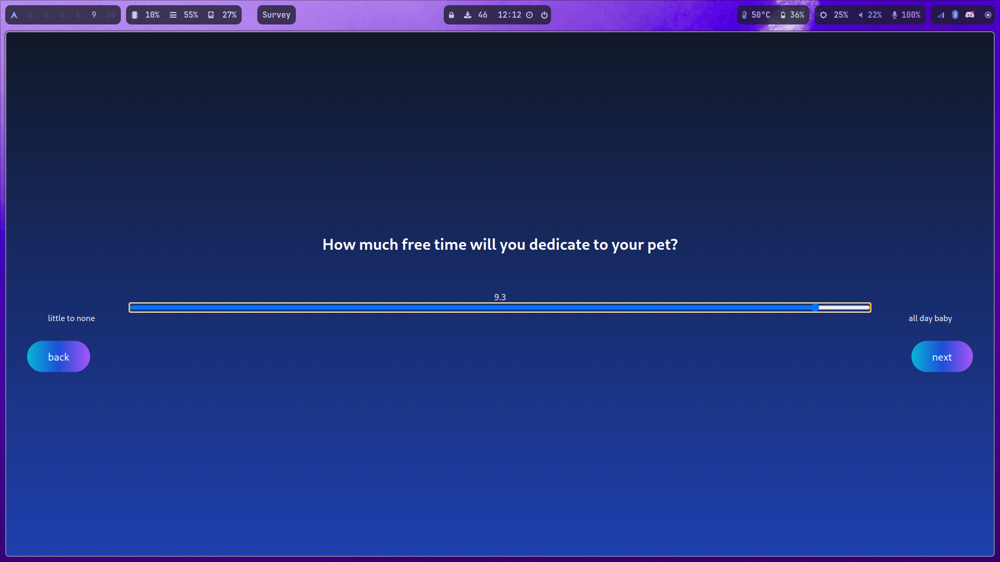
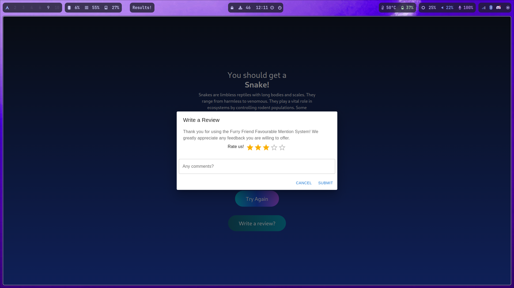

<head>
<link rel="preconnect" href="https://fonts.googleapis.com">
<link rel="preconnect" href="https://fonts.gstatic.com" crossorigin>
<link href="https://fonts.googleapis.com/css2?family=Raleway&display=swap" rel="stylesheet">
  <link rel="stylesheet" href="docs/README.css">
</head>
<div class="title">

# Furry Friend Favourable Mention System
</div>

### SE3351 Final Project

<div class="intro">

### Authors: 
| Name            | ID        |
| --------------- | --------- |
| James Nichols   | 251215184 |
| August Zilakovs | 251223010 |
| Ashraf Mahdi    | 251146581 |
| Cole McCutcheon | 251241741 |
| James Su        | 251196795 |


## Project Option 4: Pet Recommendation System


# Table of Contents 
| Section                         | Page |
| ------------------------------- | ---- |
| [Diagrams](#diagrams)           | 1    |
| [System Design](#system-design) | 2    |
| [Usage Manual](#usage-manual)   | 3    |


# Links
### Github Repository: [https://github.com/SE-3351/group-assignment-teamfiddlesticks](https://github.com/SE-3351/group-assignment-teamfiddlesticks)

### Youtube Link: [https://youtu.be/IldoNn3CtEU](https://youtu.be/IldoNn3CtEU)

</div>


<div class="pagebreak"></div>

# Diagrams
<div class="diagrams">

## Use Case Diagram


## State Diagram

</div>


# System Design

The recomendation survey uses a very simple, but effective system of mapping the survey inputs to a recomended pet using vector distances in &Ropf;4.

## Pets
Each of the 10 pets are assigned 4 values, from 1 - 10

1. Financial Requirements
2. Space Requirements
3. Time Dedication
4. Previous Experience Required

for example, `Snake`  has the values `[10, 2, 7 10]` as they are very expensive to take care of and require experience. However, small snakes like garters don't need much space, so it's assigned a 2 for space. 

## Questions
Each question is a unit vector, and the answer scales the magnitude of that unit vector. For example, "How much of your income would you spend on your animal" represents the unit vector `[1,0,0,0]`, and your response from 1 - 10 scales this vector. 

## Overall Survey Response
The survey response aggregated into a vector in &Ropf;4, which is the average of all the questions. We add the question vectors up, and divide by cardinality (number of questions).

<div class="equation">



</div>

## Picking a Pet
Choosing a pet then becomes trivial, as we measure the distance to each pet from the survey response. Whichever the shortest distance, is the recommended pet.  

## Advantages
This method is much faster, and more expandable than using a binary tree. Furthermore, binary questions can still be used, but they would be given a discrete output of `10` or `0` (in our implementation)

With this method, each pet is given 1 label for each dimension we are measuring and 1 dimension label for each question, so the labels required increases linearly with survey length and pet options. 

<div class="equation2">


</div>

In a binary tree, you would need to decide the outcome for each combination of questions, requiring exponentially more labels as the survey grows. That gets really annoying really fast, and make the survey difficult to modify. This calculation assumes that each has two options: if there are more, the base of the exponent increases and it only gets slower and more annoying to build.

<div class="equation2">


</div>

In essence, comparede to a convoluted decision tree, using this method reduces the code complexity.

### Pseudocode
```pseudocode
qunitvectors = [array of unit vectors, where the index corresponds to the question number]
qmagnitudes = [array of responses to each question]

surveyvector = [0, ..., 0]                          // initialize as the zero vector of the latent space
unitcardinality = [0, ..., 0] 

for (qindex in questionvectors) {
  surveyvector += (qmagnitudes[qindex] * qunitvectors[qindex])  // add each question to the survey vector
  unitcardinality += qunitvectors[qindex]                       // add up the cardinality 
}

surveyvector /= unitcardinality                                 // element wise division of the two

petchosen = 0
mindist = (pets[0] - surveyvector)                              // subtraction here is the vector distance
for (petindex in pets){                                         // find the minimum distance
  if ( pets[petindex] - surveyvector < mindist ){
    mindist = pets[petindex] - surveyvector;
    petchose = petindex
  }
}

``` 

## Disadvantages
Compared to a binary tree, modifying the one of the response vectors will likely change the outputs of a pretty large region in the subspace, and it is difficult to fine tune if you have exact responses you want from exact inputs. This method is much better for surveys are have many gray areas rather than those with an expected exact ouput for each input.


<div class="pagebreak"></div>

# Usage Manual

## Home Page Introduction

Once launching the application, it will welcome the user with an amazing design and animation showing all the possible pets the user can get. 
They will then be prompted with a button that says “Take the quiz”.
<div class="screenshot">


</div>

## Taking the quiz

After initiating the quiz by selecting the "Take the quiz" button, users will engage in a series of 11 questions designed to gain insights into their lifestyle and preferences. The questions are formatted to be answered on a scale from 1 to 10, with the right end representing an extreme response, and the left indicating a lower intensity.
To navigate through the questionnaire, users can effortlessly move to the next question by clicking the "Next" button. Additionally, if a user wisher to modify their answers or reconsider their choices, the "Back" button is available to naviage back to the previous question. This user-friendly approach allows individuals to provide thoughtful responses while maintaining the flexibility to review and adjust their answers as needed. Once the user has reached the last question, the user will be able to submit their results through the “Submit results” button.
<div class="screenshot">


</div>

## Viewing the results:

After the user has answered all of the questions provided, the answers are used to form the most likely answer from the available pets. The user's answers help the program decide what pet fits them the best. And then the answer is displayed to the user along with an image and brief description of the animal.
<div class="screenshot">


</div>

## User Feedback

This is a function that lets us collect the user’s thoughts on the program after they have completed a successful run. After the user has seen their results from the program, they are brought to the feedback window. This window allows the user to rate the program between one and five stars. If they wish, they can also enter comments on the program containing their opinions and recommendations. They can then click cancel or submit. Cancel clears the user’s comments and shuts down the program. Submit still shuts down the program but sends the user’s thoughts and review to us.

<div class="screenshot">


</div>

## Trying Again

Once the user has taken the quiz and got a result, they are prompted with a button that asks them if they want them to take the quiz again. Upon clicking the button that says “Take quiz again”, the user is sent back to the home introduction page where they can retake the entire quiz to get a possibly different answer if they choose so.

### [back to top](#table-of-contents)


