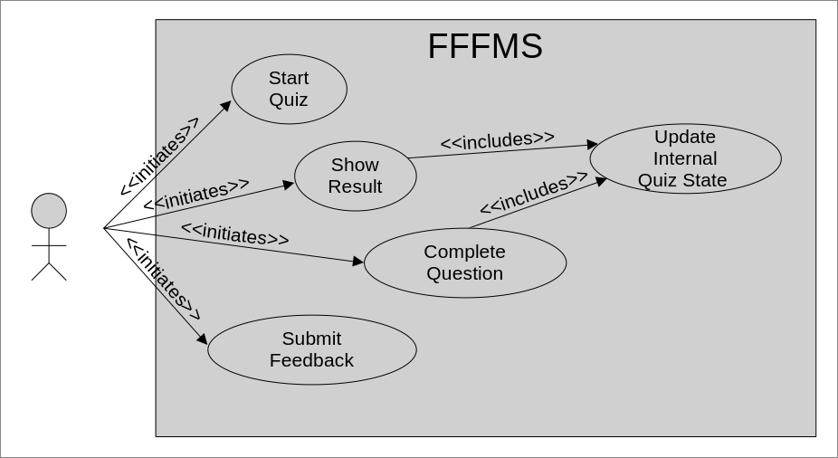

<head>
<link rel="preconnect" href="https://fonts.googleapis.com">
<link rel="preconnect" href="https://fonts.gstatic.com" crossorigin>
<link href="https://fonts.googleapis.com/css2?family=Raleway&display=swap" rel="stylesheet">
  <link rel="stylesheet" href="docs/README.css">
</head>

# Furry Friend Favourable Mention System
### SE3351 Final Project

### Authors: 
| Name            | ID        |
| --------------- | --------- |
| James Nichols   | 251215184 |
| August Zilakovs | 251223010 |
| Ashraf Mahdi    | 251146581 |
| Cole McCutcheon | 251241741 |
| James Su        | 251196795 |

### Project Option 4: Pet Recommendation System

### Github Repository
[https://github.com/SE-3351/group-assignment-teamfiddlesticks](https://github.com/SE-3351/group-assignment-teamfiddlesticks)

### Youtube Link
[todo]()

# Table of Contents 
| Section                       | Page |
| ----------------------------- | ---- |
| Diagrams                      | 1    |
| [Usage Manual](#usage-manual) | 1    |

# Diagrams

# Usage Manual

## Home Page Introduction

Once launching the application, it will welcome the user with an amazing design and animation showing all the possible pets the user can get. 
They will then be prompted with a button that says “Take the quiz”.

## Taking the quiz

After initiating the quiz by selecting the "Take the quiz" button, users will engage in a series of 11 questions designed to gain insights into their lifestyle and preferences. The questions are formatted to be answered on a scale from 1 to 10, with the right end representing an extreme response, and the left indicating a lower intensity.
To navigate through the questionnaire, users can effortlessly move to the next question by clicking the "Next" button. Additionally, if a user wisher to modify their answers or reconsider their choices, the "Back" button is available to naviage back to the previous question. This user-friendly approach allows individuals to provide thoughtful responses while maintaining the flexibility to review and adjust their answers as needed. Once the user has reached the last question, the user will be able to submit their results through the “Submit results” button.

## Viewing the results:

After the user has answered all of the questions provided, the answers are used to form the most likely answer from the available pets. The user's answers help the program decide what pet fits them the best. And then the answer is displayed to the user along with an image and brief description of the animal.

## User Feedback

This is a function that lets us collect the user’s thoughts on the program after they have completed a successful run. After the user has seen their results from the program, they are brought to the feedback window. This window allows the user to rate the program between one and five stars. If they wish, they can also enter comments on the program containing their opinions and recommendations. They can then click cancel or submit. Cancel clears the user’s comments and shuts down the program. Submit still shuts down the program but sends the user’s thoughts and review to us.

## Trying Again

Once the user has taken the quiz and got a result, they are prompted with a button that asks them if they want them to take the quiz again. Upon clicking the button that says “Take quiz again”, the user is sent back to the home introduction page where they can retake the entire quiz to get a possibly different answer if they choose so.

### [back to top](#table-of-contents)

